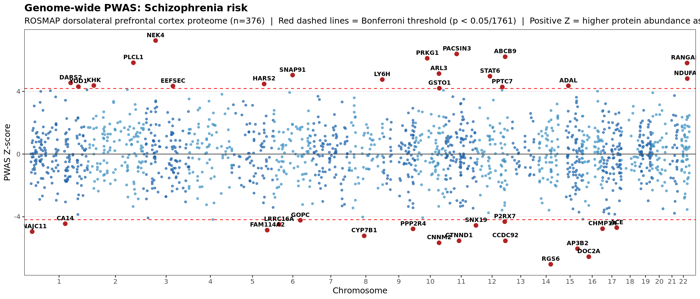
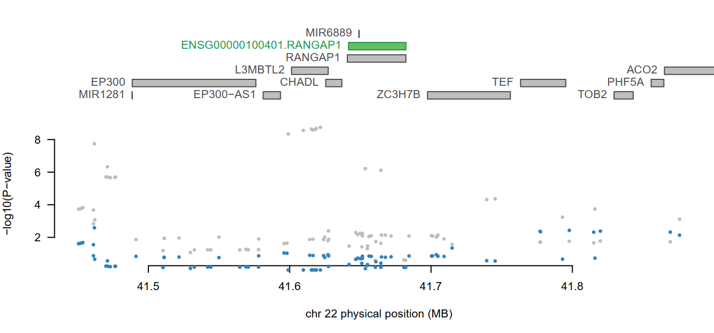

```{r setup, include=FALSE}
knitr::opts_chunk$set(echo = TRUE)
```

<style>
@import url('https://fonts.googleapis.com/css2?family=Roboto:ital,wght@0,300;0,400;0,500;0,700;1,400&family=Roboto+Mono:wght@400;500&display=swap');

body {
  font-family: 'Roboto', sans-serif;
  font-size: 16px;
  line-height: 1.75;
  color: #2d3748;
}

h1, h2, h3, h4, h5, h6 {
  font-family: 'Roboto', sans-serif;
  font-weight: 500;
  color: #1a202c;
  margin-top: 1.6em;
  margin-bottom: 0.5em;
}

p {
  margin-bottom: 1em;
}

code, pre, .sourceCode {
  font-family: 'Roboto Mono', monospace !important;
  font-size: 13.5px;
}

pre {
  background-color: #f7f8fa;
  border: 1px solid #e2e8f0;
  border-radius: 6px;
  padding: 14px 16px;
  line-height: 1.55;
  margin-top: 0.8em;
  margin-bottom: 1.2em;
}

img {
  margin-top: 0.5em;
  margin-bottom: 0.3em;
}

table {
  font-size: 15px;
  border-collapse: collapse;
  margin: 1em 0;
}

th, td {
  padding: 8px 14px;
  border: 1px solid #e2e8f0;
}

th {
  background-color: #f7f8fa;
  font-weight: 500;
}
</style>

<div id="workshop-logo" style="text-align: center; margin-bottom: 1.5em;"><br><br>📅 <a href="https://www.dropbox.com/scl/fi/7nffouc9k4kloxhi15q10/2nd-King-s-UNICAMP-Workshop-Agenda.pdf?rlkey=744rqdg3byku35daaw3hk9k8u&dl=0" target="_blank"><strong>Download the workshop agenda</strong></a></div>

<script>
document.addEventListener("DOMContentLoaded", function() {
  var logo = document.getElementById("workshop-logo");
  var header = document.getElementById("header");
  if (header && logo) {
    header.parentNode.insertBefore(logo, header);
  }
});
</script>

This tutorial will guide you through installing two conda/mamba environments, where you will perform standard quality control of GWAS results and perform a proteome-wide association study (PWAS).

**Target audience:** researchers and students with little or no prior coding experience who want to develop bioinformatics skills — ideally alongside tools like ChatGPT or Google, which are genuinely useful companions for navigating error messages, understanding commands, and troubleshooting. 😉

**What you need:** just your own computer. If you are a Windows User, you will need to have WSL installed to access Ubuntu's Terminal (see [this link](https://learn.microsoft.com/en-us/windows/wsl/install)). If you are MacOS or Linux user, you can just use Terminal.

# 1) Set up environments (`fusion_final` and `ldsc`)


## Create `fusion_final` environment

A GWAS identifies genetic variants (SNPs) statistically associated with a disease — but most significant SNPs sit in non-coding regions, making it unclear which genes or proteins they actually affect. **FUSION** closes this gap using pre-computed "weights": statistical models that predict how SNP genotypes influence the expression or abundance of specific proteins in a given tissue (here, the dorsolateral prefrontal cortex from the [ROSMAP project](https://www.synapse.org/Synapse:syn23245237)). By combining these weights (from a non-disease cohort) with GWAS results (from case-control cohort), FUSION estimates which proteins' genetically-predicted levels associate with disease risk, without requiring you to measure protein levels directly in patients. When applied to proteins this is called a **proteome-wide association study (PWAS)**; to gene expression, a **transcriptome-wide association study (TWAS)**.


FUSION requires a specific and somewhat dated combination of R, Python, and C libraries that often clash with other software. We install it in an isolated `conda`/`mamba` environment called `fusion_final` — a self-contained sandbox where all required package versions coexist without interfering with the rest of your system.


```{bash, eval=F}

# Create a pwas folder and enter it
mkdir -p ~/pwas
cd ~/pwas

# Download the conda environment file from the tutorial repository
wget https://raw.githubusercontent.com/rodrigoduarte88/kings_unicamp_pwas/refs/heads/main/fusion_final_environment.yml

# Create the conda environment
mamba env create -f fusion_final_environment.yml -y

# Activate it. Note: conda and mamba are interchangeable for activation.
conda activate fusion_final

# Download and unzip FUSION
wget https://github.com/gusevlab/fusion_twas/archive/master.zip -O fusion.zip
unzip fusion.zip

# FUSION's scripts look for a utils/ folder in the working directory.
# Create a symlink so they find it without needing to change directories.
ln -s ~/pwas/fusion_twas-master/utils ~/pwas/utils

# Rename some conda libraries that R expects under different names (don't ask! 😂)
cd $CONDA_PREFIX/lib
mv liblapack.so libRlapack.so
mv libblas.so libRblas.so

# Return to the working folder, then start R to install additional packages
cd ~/pwas
R

# Inside R — install plink2R and other required libraries
devtools::install_github("carbocation/plink2R/plink2R", ref="carbocation-permit-r361", upgrade = "never")
install.packages(c("optparse", "doMC", "here", "corrplot"), repos = "https://cloud.r-project.org")

# Quit R without saving
quit("no")

```


## Create `ldsc` environment

**LDSC** (LD Score Regression) was developed to estimate heritability and genetic correlations from GWAS summary statistics. Here we only need its companion script `munge_sumstats.py` as a quality-control tool: it standardises column names, removes rare/poorly imputed/strand-ambiguous SNPs, and outputs a clean file that FUSION can read. Because LDSC requires a different set of Python dependencies from FUSION, it lives in its own isolated environment called `ldsc`.


```{bash, eval=F}
cd ~/pwas

# Clone the ldsc repository (Python 3 branch)
git clone -b ldsc39 https://github.com/CBIIT/ldsc.git
cd ldsc
mamba create --file environment3.yml -y
conda activate ldsc

# Test that ldsc is working — should print a list of options
./munge_sumstats.py --help

```


# 2) Download required files and decompress


To run a PWAS, FUSION needs three types of input:

- **GWAS summary statistics**: the per-SNP association results from a genome-wide study (effect sizes, P-values, allele information). This is what we want to interpret biologically — which genes/proteins might be driving the genetic risk captured in the GWAS?

- **Reference panel**: individual-level genotype data (1000 Genomes Project, European subset) used to model linkage disequilibrium (LD) between nearby SNPs. FUSION needs this to correctly combine the SNP weights with the GWAS results.

- **SNP weights**: pre-trained models predicting each protein's abundance from nearby SNP genotypes, built from a dataset where both genotypes and protein levels were measured in the same individuals. This is the key ingredient that lets FUSION link GWAS signals to proteins without needing matched proteomics data in your own cohort.


```{bash, eval=F}

# Download GWAS summary statistics (schizophrenia, European subset, PGC3)
# NOTE: this file is hosted temporarily on Dropbox. The official source is the PGC website
# (https://pgc.unc.edu/for-researchers/download-results/). Please do not redistribute
# this link — download directly from the PGC for any purpose beyond this tutorial.
mkdir -p ~/pwas/gwas && cd ~/pwas/gwas
wget "https://www.dropbox.com/scl/fi/x76pj6sym4e7h96l4r3oc/PGC3_SCZ_wave3.european.autosome.public.v3.vcf.tsv.gz?rlkey=odwlnpipwpfb33zguulkja843&dl=1" -O schizophrenia_EUR.tsv.gz
# We'll keep this compressed for now and explore/decompress it in the next section.

# Download reference panel (1000 Genomes, European subset)
mkdir -p ~/pwas/ref_pop && cd ~/pwas/ref_pop
wget "https://www.dropbox.com/scl/fi/scy0xb4i781h3e3u9hc12/1000G_ref_panel.tgz?rlkey=izddas83k8q4n6apyh28908cg&dl=1" -O 1000G_ref_panel.tgz
tar zxvf 1000G_ref_panel.tgz

# Download and decompress PWAS SNP weights (ROSMAP dorsolateral prefrontal cortex)
# This is arguably the most interesting choice in the entire pipeline — alongside the GWAS itself.
# The SNP weights define WHICH tissue or brain region you are asking about, and swapping them
# out is all it takes to run the same analysis in a completely different biological context.
# Want to ask which proteins in the cerebellum, or the hippocampus, or blood, are associated
# with your GWAS? Just use a different set of weights. This versatility is what makes
# FUSION/TWAS-style analyses so powerful and widely applicable.
#
# Here we use proteomics weights from ROSMAP (dorsolateral prefrontal cortex, n=376).
# The FUSION website (http://gusevlab.org/projects/fusion/) hosts many additional weight
# sets from a wide range of brain regions and tissues — note that most of those are
# transcriptomics (RNA expression), not proteomics, so they would give you a TWAS rather
# than a PWAS. The biology you can interrogate depends entirely on the weights you choose.
mkdir -p ~/pwas/weights && cd ~/pwas/weights
wget "https://www.dropbox.com/scl/fi/4ziqswrkb7z0g77tir3qy/ROSMAP.n376.fusion.WEIGHTS-v2.zip?rlkey=q1l4q876i2hpdzoaexuxohcgy&dl=1" -O ROSMAP.n376.fusion.WEIGHTS-v2.zip
conda activate fusion_final
unzip ROSMAP.n376.fusion.WEIGHTS-v2.zip

# The weights folder has a space in its name, which causes downstream crashes in R.
# Rename it now so all output file paths are space-free.
mv ROSMAP.n376.fusion.WEIGHTS\ v2 ROSMAP.n376.fusion.WEIGHTSv2

cd ~/pwas

```


# 3) Explore and pre-process GWAS results


This GWAS file uses a **VCF-like format** (Variant Call Format), which opens with many lines beginning with `##` — annotation/comment lines describing the file's provenance, format, and version. These contain no SNP data and are ignored by downstream tools. For example:

```
##fileFormat=PGCsumstatsVCFv1.0
##CAVEAT EMPTOR: ALWAYS CHECK FOR NEWER VERSION
##fileDate="20220131"
##preparedBy="VassilyTrubetskoy"
##DOI=<ID=BIORXIV,REF="https://doi.org/10.1101/2020.09.12.20192922">
##sumstatsLINK=<ID=SUMSTATS,REF="http://www.med.unc.edu/pgc/results-and-downloads">
```


After the `##` lines, a plain-text column header appears, followed by the SNP data rows (one per variant):

```
CHROM  ID           POS        A1  A2  FCAS   FCON   IMPINFO  BETA       SE      PVAL    NCAS   NCON   NEFF
8      rs62513865   101592213  C   T   0.930  0.927  0.963    0.01200    0.0171  0.4847  53386  77258  58749
8      rs79643588   106973048  G   A   0.907  0.906  0.997   -0.00860    0.0148  0.5605  53386  77258  58749
8      rs17396518   108690829  T   G   0.565  0.566  0.985   -0.00210    0.0087  0.8145  53386  77258  58749
8      rs983166     108681675  A   C   0.564  0.563  0.988    0.00490    0.0087  0.5704  53386  77258  58749
```


Key columns:

- **`ID`**: the SNP's rsID — a unique identifier (e.g. `rs62513865`).
- **`A1` / `A2`**: effect allele and reference allele. `BETA` is reported for `A1`.
- **`BETA`**: effect size (log odds ratio). Positive = `A1` associates with *increased* schizophrenia risk; negative = *decreased* risk. Individual SNP effects are typically very small (0.01–0.05) — genetic risk is spread across thousands of SNPs.
- **`SE`**: standard error of `BETA`. Smaller = more precise. `munge_sumstats` uses BETA/SE to compute a Z-score.
- **`PVAL`**: association P-value. Genome-wide significance threshold is conventionally 5×10⁻⁸.
- **`IMPINFO`**: imputation quality score (0–1). Most GWAS SNPs are not directly genotyped but *imputed* from nearby SNPs; values close to 1 indicate reliable imputation. `munge_sumstats` filters low-quality SNPs using this column.
- **`NEFF`**: effective sample size (accounting for case/control ratio). Used by `munge_sumstats` for filtering.
- **`FCAS` / `FCON`**: allele frequency in cases and controls. Similar values are expected for most SNPs.


```{bash, eval=F}
cd ~/pwas/gwas

# Decompress the GWAS file
gunzip schizophrenia_EUR.tsv.gz

# How many lines in total (comment lines + header + SNP rows)?
wc -l schizophrenia_EUR.tsv

# Peek at the first few lines — you'll see the ## comment lines
head schizophrenia_EUR.tsv

# Peek at the first 100 lines — the ## lines end and the column header + data appear
head -100 schizophrenia_EUR.tsv

# Show just the column header and first few SNP rows (skipping ## comment lines)
grep -v "^#" schizophrenia_EUR.tsv | head

# Explore the last few lines
tail schizophrenia_EUR.tsv

# Remove all lines starting with # (comment lines)
sed -i '/^#/ d' schizophrenia_EUR.tsv

# Check the file after cleaning
head schizophrenia_EUR.tsv

# QC and reformat with munge_sumstats (switch to ldsc environment first)
conda activate ldsc

~/pwas/ldsc/munge_sumstats.py --sumstats schizophrenia_EUR.tsv --out schizophrenia.processed \
--snp ID --a1 A1 --a2 A2 --p PVAL --N-col NEFF --info IMPINFO --chunksize 500000

# Your filtered GWAS file is now at: ~/pwas/gwas/schizophrenia.processed.sumstats.gz

```


When munge_sumstats finishes, look for a line like:

```
Writing summary statistics for 5392569 SNPs (5392569 with nonmissing beta) to schizophrenia.processed.sumstats.gz.
```

Pay attention to this number — you want **at least ~1 million SNPs** remaining. Far fewer may indicate wrong column names, a genome build mismatch, or an overly strict quality filter. Check the log for warnings if something seems off.

---

**❓ Question: what does the processed file actually look like?**

Since the output file is gzip-compressed (`.gz`), you can't open it directly with `head`. Instead, use `zcat`, which decompresses a `.gz` file and streams its contents to the terminal — you can then pipe that output into `head` to see just the first few lines:

```{bash, eval=F}
zcat schizophrenia.processed.sumstats.gz | head
```

You should see something like this:

```
SNP         A1  A2  Z       N
rs62513865  C   T   0.699   58749.130
rs79643588  G   A  -0.582   58749.130
rs17396518  T   G  -0.235   58749.130
rs983166    A   C   0.567   58749.130
rs28842593  T   C  -0.320   58749.130
```

The munged file is much simpler than the original: just five columns (`SNP`, `A1`, `A2`, `Z`, `N`). `munge_sumstats.py` standardises GWAS summary statistics into a minimal format that FUSION and LDSC expect. The main transformation is that `BETA` and `SE` are combined into a single **Z-score** (Z = BETA / SE), which captures both direction and significance in one number. Everything else — P-values, allele frequencies, imputation quality — has already served its purpose during QC and is dropped.

> 💡 **A note on file formats:** different programs and websites expect GWAS summary statistics in different formats, often with specific column names, column ordering, or required fields. FUSION expects exactly the format produced here (`SNP`, `A1`, `A2`, `Z`, `N`). But if you were feeding these results into another tool — for example, FUMA, which requires a P-value column; or coloc, which needs effect sizes and standard errors — you would need to go back to the original cleaned file (`schizophrenia_EUR.tsv`) and reformat or rename columns accordingly. Getting comfortable with inspecting and reformatting summary statistics files using tools like `head`, `awk`, and `sed` is one of the most transferable practical skills in statistical genetics.


# 4) Run the PWAS

We now have everything in place: cleaned GWAS summary statistics, a reference panel, and SNP weights. FUSION will go through each protein in the weights panel, use the SNP weights to predict its abundance based on genotype, and test whether that predicted abundance associates with schizophrenia risk — one chromosome at a time.

For the tutorial, we'll run **chromosome 22** only (one of the smaller autosomes, so it completes quickly).


```{bash, eval=F}
cd ~/pwas
conda activate fusion_final

Rscript --verbose --no-save fusion_twas-master/FUSION.assoc_test.R \
--sumstats gwas/schizophrenia.processed.sumstats.gz \
--weights weights/ROSMAP.n376.fusion.WEIGHTSv2/train_weights.pos \
--weights_dir weights/ROSMAP.n376.fusion.WEIGHTSv2/ \
--ref_ld_chr ref_pop/LDREF_harmonized/1000G.EUR. \
--chr 22 \
--out schizophrenia.chr22.dat

# How many features were tested on chromosome 22?
wc -l schizophrenia.chr22.dat
# Expected: 56 lines (1 header + 55 features)

# Bonferroni correction uses the TOTAL features in the panel (all chromosomes),
# not just chr22 — the .pos file defines the full set of tests being performed.
N_FEATURES=$(($(wc -l < weights/ROSMAP.n376.fusion.WEIGHTSv2/train_weights.pos) - 1))
echo "Total features in panel: $N_FEATURES"         # 1761
echo "Bonferroni threshold: $(echo "scale=10; 0.05/$N_FEATURES" | bc)"   # ~2.84e-05

# Extract features passing the Bonferroni threshold
cat schizophrenia.chr22.dat | awk -v n=$N_FEATURES 'NR == 1 || $NF < 0.05/n' > schizophrenia.chr22.dat.Sig

# Inspect significant results
cat schizophrenia.chr22.dat.Sig

```


FUSION tested **55 features** on chromosome 22. After Bonferroni correction (0.05/1761 ≈ 2.84×10⁻⁵), **two proteins pass**: `RANGAP1` and `NDUFA6`.


The output has one row per feature. Key columns:

| Column | Meaning |
|---|---|
| `ID` | Ensembl ID + gene name (e.g. `ENSG00000100401.RANGAP1`) |
| `CHR`, `P0`, `P1` | Chromosome and genomic coordinates |
| `HSQ` | SNP heritability of protein abundance |
| `BEST.GWAS.ID`, `BEST.GWAS.Z` | Strongest GWAS SNP in the region and its Z-score |
| `NSNP`, `NWGT` | Total SNPs in region / SNPs used in the model |
| `MODEL` | Prediction model (`enet` = elastic net, `bslmm` = Bayesian sparse LMM, `top1` = single top SNP) |
| `MODELCV.R2` | Cross-validated R² — how well genetics predicts protein levels |
| `TWAS.Z`, `TWAS.P` | **Main result**: Z-score and P-value for the PWAS association |


A **positive `TWAS.Z`** means higher genetically-predicted protein levels associate with *increased* risk; **negative** means the opposite (lower levels → more risk). Both significant proteins have positive Z-scores:

- **RANGAP1** (regulator of nuclear transport): `TWAS.Z = +5.81`, `p = 6.15×10⁻⁹`. Best local GWAS SNP `rs2179744` (Z = 6.02). Elastic net model, R² = 0.029.
- **NDUFA6** (mitochondrial complex I subunit): `TWAS.Z = +4.82`, `p = 1.45×10⁻⁶`. Top GWAS SNP `rs5751204` (Z = −6.91) is also the best eQTL for this protein (R² = 0.104), suggesting a direct link between the GWAS signal and protein regulation.


## Running the full analysis across chromosomes and plotting a Miami plot

**→ Skip this section if you only ran chromosome 22 during the tutorial.**

FUSION analyses one chromosome at a time. For a complete genome-wide PWAS you would loop over all 22 autosomes using a **`for` loop** — a bash construct that repeats a command for each value in a list. In `for i in {1..22}`, `i` takes each value from 1 to 22, and `$i` inside the loop is replaced by the current value automatically. This takes ~20–30 minutes but you are welcome to run it if you'd like the full results.

```{bash, eval=F}
cd ~/pwas
conda activate fusion_final

for i in {1..22}
do
  Rscript --verbose --no-save fusion_twas-master/FUSION.assoc_test.R \
  --sumstats gwas/schizophrenia.processed.sumstats.gz \
  --weights weights/ROSMAP.n376.fusion.WEIGHTSv2/train_weights.pos \
  --weights_dir weights/ROSMAP.n376.fusion.WEIGHTSv2/ \
  --ref_ld_chr ref_pop/LDREF_harmonized/1000G.EUR. \
  --chr $i \
  --out schizophrenia.chr$i.dat
done
```

Once all chromosomes are done, a **Miami plot** lets you visualise the full PWAS at a glance — showing the PWAS Z-score for every feature across the genome, arranged by chromosomal position. Unlike a standard Manhattan plot (−log10 P), it preserves the **direction** of each association: proteins above the x-axis associate with increased risk, those below with decreased risk. Significant hits are highlighted in red and labelled by gene name.

```{bash, eval=F}
cd ~/pwas

# Download the Miami plot script from the tutorial repository
wget https://raw.githubusercontent.com/rodrigoduarte88/kings_unicamp_pwas/refs/heads/main/miami_plot.R

conda activate fusion_final
Rscript miami_plot.R
# Output: ~/pwas/miami_plot.png
```


```{r miami-plot, echo=FALSE, out.width="100%", fig.cap="**Figure 1. Genome-wide PWAS Miami plot.** PWAS Z-score for each protein in the ROSMAP dorsolateral prefrontal cortex panel (n=376), plotted by chromosomal position. Proteins above the x-axis have higher genetically-predicted levels associated with increased schizophrenia risk; proteins below the x-axis have the opposite direction of effect. Red dashed lines mark the Bonferroni significance threshold (p < 0.05/1761). Significant proteins are highlighted in red and labelled by gene name."}

```


## Conditional analysis


The **conditional analysis** (`FUSION.post_process.R`) is run on the significant proteins from each chromosome to confirm whether their associations are truly independent. RANGAP1 (chr22: ~41.6 Mb) and NDUFA6 (chr22: ~42.5 Mb) are ~840 kb apart and driven by different GWAS SNPs (`rs2179744` and `rs5751204` respectively) — they are in separate loci and their signals are indeed independent, as confirmed by the conditional analysis (both appear in `joint_included`, none in `joint_dropped`). The conditional analysis also generates locus plots for each independent signal, showing the GWAS association alongside the PWAS result and what happens to nearby SNPs after conditioning.


```{bash, eval=F}
cd ~/pwas

Rscript fusion_twas-master/FUSION.post_process.R \
--input schizophrenia.chr22.dat.Sig \
--sumstats gwas/schizophrenia.processed.sumstats.gz \
--ref_ld_chr ref_pop/LDREF_harmonized/1000G.EUR. \
--out schizophrenia.chr22.dat.Sig.PostProc.dat \
--chr 22 \
--save_loci \
--plot \
--locus_win 100000

```


If you ran the full genome-wide PWAS, you can loop over all chromosomes — skipping those with no significant results. **→ Skip this block if you only ran chromosome 22.**


```{bash, eval=F}
cd ~/pwas

for i in {1..22}
do
  SIG=schizophrenia.chr$i.dat.Sig
  if [ -f "$SIG" ] && [ $(wc -l < "$SIG") -gt 1 ]; then
    Rscript fusion_twas-master/FUSION.post_process.R \
    --input $SIG \
    --sumstats gwas/schizophrenia.processed.sumstats.gz \
    --ref_ld_chr ref_pop/LDREF_harmonized/1000G.EUR. \
    --out schizophrenia.chr$i.dat.Sig.PostProc.dat \
    --chr $i \
    --save_loci \
    --plot \
    --locus_win 100000
  else
    echo "Chromosome $i: no significant features, skipping."
  fi
done
```


The locus plot for the RANGAP1 region (locus 1) is shown below:


```{r loc1-plot, echo=FALSE, out.width="100%", fig.cap="**Figure 2. Locus plot for the RANGAP1 region on chromosome 22 (~41.6 Mb).** Gene positions are shown in the upper panel; GWAS association signals (−log10 P) are shown as coloured dots. The green gene (RANGAP1) is the independently significant PWAS signal at this locus. Blue dots show GWAS SNP associations after conditioning on RANGAP1's predicted protein levels — they drop to near zero, suggesting that RANGAP1 fully explains the GWAS signal here. NDUFA6, the other significant protein on chr22, lies ~840 kb away in a separate, independent locus and is not shown in this plot."}

```


#### Explore `schizophrenia.chr22.dat.Sig.PostProc.dat`, the other output files, and the plots!


# 5) Where to go from here

The PWAS we ran here is a powerful starting point, but several complementary analyses can deepen interpretation of the results.

## Staying within the molecular QTL framework

**Colocalisation** asks a more specific question than PWAS: do the GWAS signal and the protein/expression QTL signal at a given locus actually share the same causal variant, or are they two independent signals that happen to be in the same region due to LD? This is typically tested using tools such as the [`coloc`](https://chr1swallace.github.io/coloc/) R package, which computes posterior probabilities for five scenarios (e.g. no association in either dataset, association in one only, two independent signals, or one shared causal variant). FUSION's conditional analysis already gives a first pass at this, but coloc provides a formal statistical framework for variant-level colocalisation.

**TWAS/PWAS fine-mapping with FOCUS** addresses a different problem: when several genes or proteins in the same locus are significant by PWAS (even after conditioning), how do we decide which one is most likely to be the causally relevant gene? [FOCUS](https://github.com/bogdanlab/focus) uses a Bayesian fine-mapping approach to compute posterior inclusion probabilities for each gene/protein, producing a credible set of likely causal genes — analogous to credible sets in SNP-level fine-mapping.

## Broader GWAS annotation and enrichment

Beyond the expression-centric approaches above, GWAS results can also be interpreted at a higher biological level:

- **Gene-level association testing** (e.g. via [MAGMA](https://ctg.cncr.nl/software/magma)): aggregates SNP-level P-values across gene windows to identify genes with an overall burden of association, increasing power for genes with many SNPs of modest effect.

- **Gene-set and pathway enrichment** (e.g. MAGMA gene-set analysis): tests whether genes implicated by the GWAS cluster in known biological pathways or cell-type-specific gene expression profiles — moving from individual genes to higher-level biological insight such as enrichment in synaptic signalling or immune pathways.

- **Tissue and cell-type enrichment, eQTL annotation, and gene mapping** can be performed together using [**FUMA**](https://fuma.ctglab.nl/), a free web platform that takes GWAS summary statistics and automates a wide range of downstream annotation steps. Note that FUMA is best suited for these broader annotation tasks — it is not designed for formal colocalisation with expression signatures (use `coloc` or SMR for that) or for TWAS/PWAS fine-mapping (use FOCUS for that).
